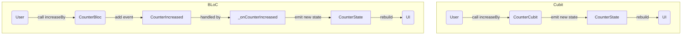

# 📘 Cubit y BLoC - Explicación detallada

Este documento describe de forma didáctica y técnica cómo funcionan los dos
implementaciones del contador que hay en `lib/presentation/blocs`:
- **CounterCubit** (patrón Cubit)
- **CounterBloc** (patrón BLoC completo)

Ambas soluciones realizan la misma función visible (un contador con botones)
pero emplean arquitecturas distintas. Puedes usar este archivo como referencia
única para entender su código y diferencias.

---

## 🔧 Estructura de los ficheros

```
lib/presentation/blocs/
├── counter_cubit/
│   ├── counter_cubit.dart      ← lógica Cubit
│   └── counter_state.dart      ← estado Cubit
├── counter_bloc/
│   ├── counter_bloc.dart       ← lógica BLoC
│   ├── counter_event.dart      ← eventos BLoC
│   └── counter_state.dart      ← estado BLoC
└── documentation/
    └── cubit_vs_bloc.md        ← este archivo
```

Los dos patrones comparten un `CounterState` similar (aunque con valores
iniciales distintos) y un `copyWith` para conservar la inmutabilidad.

---

## 🧠 Conceptos Básicos

### Estado (State)
La clase `CounterState` representa los datos actuales del contador:
- `int counter`: valor numérico mostrado en pantalla
- `int transactionCount`: número de veces que el contador ha cambiado

Ambas implementaciones usan [Equatable] para comparar estados por valor y
permitir que los widgets se reconstruyan sólo cuando de verdad cambie algo.
Los estados son inmutables: nunca se modifica un objeto, siempre se emite uno
nuevo con `copyWith`.

### Inmutabilidad y copyWith()
```dart
---------------------------------------------------------------------------
final newState = state.copyWith(counter: state.counter + 1);
---------------------------------------------------------------------------
```
`copyWith` devuelve un nuevo `CounterState` con los campos actualizados y los
restantes heredados del estado anterior.

---

## 💠 Patrón Cubit (CounterCubit)

### Archivos implicados
- `counter_cubit.dart`
- `counter_state.dart`

### ¿Qué es un Cubit?
Un Cubit es la versión simplificada de un BLoC. No utiliza eventos, se expone
como una clase con métodos que llaman directamente a `emit()`.

### counter_state.dart (Cubit)
```dart
---------------------------------------------------------------------------
class CounterState extends Equatable {
  final int counter;
  final int transactionCount;
  
  const CounterState({this.counter = 0, this.transactionCount = 0});
  
  copyWith({int? counter, int? transactionCount}) =>
      CounterState(
        counter: counter ?? this.counter,
        transactionCount: transactionCount ?? this.transactionCount,
      );
  @override List<Object> get props => [counter, transactionCount];
}
---------------------------------------------------------------------------
```
El get props se utiliza para comparar los CounterState y que Equatable 
identifique si ha habido cambios.

Valores por defecto 0; sin embargo el cubit se inicializa manualmente con
`counter: 5` en su constructor.

### counter_cubit.dart
```dart
---------------------------------------------------------------------------
class CounterCubit extends Cubit<CounterState> {
  CounterCubit() : super(const CounterState(counter: 5));

  void increaseBy(int value) {
    emit(state.copyWith(
      counter: state.counter + value,
      transactionCount: state.transactionCount + 1,
    ));
  }

  void reset() {
    emit(state.copyWith(counter: 0));
  }
}
---------------------------------------------------------------------------
```

#### Flujo de trabajo
1. La UI obtiene el cubit con `context.read<CounterCubit>()`.
2. Llama a `increaseBy(3)` o `reset()`.
3. El método calcula un nuevo estado y hace `emit(newState)`.
4. Widgets que escuchan (`BlocBuilder` o `context.watch/select`) se reconstruyen.

> **Nota:** no hay eventos intermedios, el cubit expone directamente los métodos.

### Ventajas del Cubit
- Código más corto y fácil de seguir
- Ideal para casos simples como contadores, booleans, pequeños formularios
- Menos boilerplate que un BLoC

---

## 🔵 Patrón BLoC (CounterBloc)

### Archivos implicados
- `counter_bloc.dart`
- `counter_event.dart`
- `counter_state.dart`

### ¿Qué es un BLoC?
BLoC (Business Logic Component) separa la lógica en tres piezas:
- **Eventos**: entradas declarativas lanzadas por la UI (o cualquier fuente)
- **Estado**: objetos que describen la situación actual
- **Manejadores**: funciones que convierten eventos en nuevos estados

### counter_event.dart
```dart
---------------------------------------------------------------------------
abstract class CounterEvent { const CounterEvent(); }
class CounterIncreased extends CounterEvent {
  final int value;
  const CounterIncreased(this.value);
}
class CounterReset extends CounterEvent {}
---------------------------------------------------------------------------
```
Cada evento es una clase inmutable. `CounterIncreased` lleva el valor a sumar.

### counter_state.dart (BLoC)
Simétrico al del Cubit, pero con valor inicial 10.

### counter_bloc.dart
```dart
---------------------------------------------------------------------------
class CounterBloc extends Bloc<CounterEvent, CounterState> {
  CounterBloc() : super(const CounterState()) {
    on<CounterIncreased>(_onCounterIncreased);
    on<CounterReset>(_onCounterReset);
  }

  void _onCounterIncreased(CounterIncreased event, Emitter<CounterState> emit) {
    emit(state.copyWith(
      counter: state.counter + event.value,
      transactionCount: state.transactionCount + 1,
    ));
  }

  void _onCounterReset(CounterReset event, Emitter<CounterState> emit) {
    emit(state.copyWith(counter: 0));
  }

  // helpers
  void increaseBy([int value = 1]) => add(CounterIncreased(value));
  void resetCounter() => add(CounterReset());
}
---------------------------------------------------------------------------
```

#### Flujo de trabajo BLoC
1. La UI obtiene el bloc con `context.read<CounterBloc>()`.
2. Llama al helper `increaseBy(2)` o `resetCounter()`.
3. El helper añade un evento (`add(...)`).
4. El BLoC recibe el evento y ejecuta el handler correspondiente
   (`_onCounterIncreased` o `_onCounterReset`).
5. El handler emite un nuevo estado con `emit()`.
6. Widgets escuchantes se reconstruyen.

> **Beneficio:** los eventos pueden ser interceptados, transformados o testados
por separado; el flujo es explícito y testeable.

### Ventajas del BLoC
- Escalable a múltiples eventos y estados complejos
- Mejor para lógica con múltiples fuentes de eventos
- Facilita testing unitario e integración
- Proporciona trazabilidad (cada evento es un archivo/instance)

---

## 🔁 Comparativa rápida

| Aspecto | Cubit | BLoC |
|--------|--------|------|
| Código | Simple | Verboso |
| Eventos | No | Sí (clases) |
| Boilerplate | Bajo | Alto |
| Escalabilidad | Media | Alta |
| Testeo | Fácil | Muy fácil |
| Valores iniciales | contador=5 | contador=10 |
| Uso recomendado | Casos simples | Casos complejos |

---

## 📌 Recomendaciones didácticas

- Para aprender, empieza escribiendo el `CounterCubit` y su pantalla;
  verás el resultado sin eventos.
- Luego agrega el `CounterBloc` y compara ambos; notarás cómo el flujo se
torna más explícito.
- Observa el uso de `context.select()` en los widgets: muestra sólo la
  propiedad que interesa y evita reconstrucciones innecesarias.
- Usa `BlocProvider` para inyectar ambos en la UI; el patrón es idéntico, lo
  único que cambia es el tipo genérico.

---

## 📈 Diagrama del flujo (Mermaid)



---

## 🛠 Tips técnicos

- Ambos estados implementan `List<Object> get props` para Equatable.
- Los valores iniciales se configuran en el constructor del Cubit/Bloc.
- En apps reales, quizá quieras separar el estado en otro archivo o carpeta
  para reutilizarlo entre múltiples BLoCs/Cubits.
- Para efectos secundarios (API calls, navegación) usa `BlocListener` o
  `on<Event>((e, emit) async { ... })`.

---

## 🔚 Conclusión

Este único archivo ofrece una vista íntegra de cómo funcionan las dos formas
de gestionar el contador. Puedes guardarlo en
`lib/presentation/blocs/documentation/` y referenciarlo cuando necesites
revisar o enseñar la diferencia entre Cubit y BLoC.

¡Disfruta explorando el código y aprendiendo! 🎓
